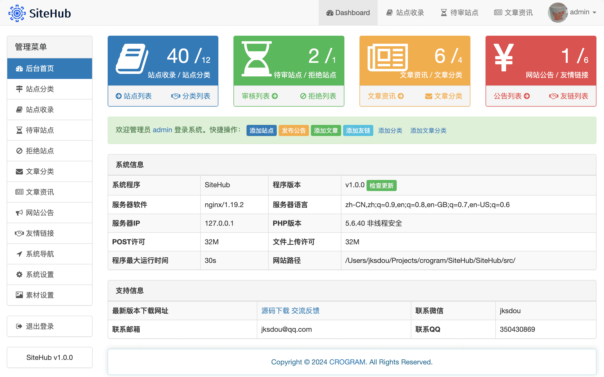

# SiteHub 网址导航系统

简体中文 | [English](./README.md)

## 项目简介

SiteHub 是一个开源的的网址导航系统，采用 PHP + MySQL 技术开发，拥有独立的安装和后台系统，后台采用 Bootstrip 框架，前台使用响应式界面，自适应各种屏幕。

**预览截图**：



**后台功能：**

1.支持修改网站信息

2.支持修改管理员信息

3.支持修改网站素材，如 logo/favicon 图标/微信二维码 等图片

4.支持添加/修改/删除导航

5.支持添加/修改/删除分类

6.支持添加/修改/删除站点

7.支持审核/删除站点申请

8.支持发布/修改/删除公告

9.支持添加/修改/删除友情链接

**前台特色：**

1.所有分类下的站点

2.单个分类下的站点

3.各站点详情页

4.分类滚动定位

5.记录各站点浏览数

6.点赞功能（单个 ip 单个站点只能点赞一次）

7.站点详情页显示站点缩略图

8.站点炫酷跳转页

9.右下角悬浮按扭（去顶部/qq/邮箱/微信二维码）

10.搜索功能（支持搜索站点名称/站点链接/站点简介）

11.访客申请站点收录功能

12.关于我们页面

13.站点图片懒加载

14.分类/站点链接别名

## 运行环境

Nginx/Apache、PHP 5.4+、MySQL 5.6+

## 部署方法

1. 将 `src` 目录内文件全部上传到网站运行目录

2. 访问网址 http://你的网站地址/install/

3. 按照页面引导，输入数据库帐号及密码信息，提交安装

4. 默认后台地址：http://你的网站地址/admin/，默认账号：admin，默认密码：123456

5. 然后服务器设置好伪静态规则

6. 访问网站 OK

## 伪静态配置规则：

Nginx 伪静态规则

```
rewrite ^/index.html$ /index.php last;
rewrite ^/about.html$ /about.php last;
rewrite ^/search.html$ /search.php last;
rewrite ^/ranking.html$ /ranking.php last;
rewrite ^/apply.html$ /apply.php last;
rewrite ^/404.html$ /404.php last;
rewrite ^/category-([1-9]+[0-9]*).html$ /category.php?id=$1 last;
rewrite ^/category-([a-zA-Z]+).html$ /category.php?alias=$1 last;
rewrite ^/site-([1-9]+[0-9]*).html$ /site.php?id=$1 last;
rewrite ^/article.html$ /article.php last;
rewrite ^/article-list-([1-9]+[0-9]*).html$ /article_list.php?id=$1 last;
rewrite ^/article-([1-9]+[0-9]*).html$ /article_show.php?id=$1 last;
rewrite ^/img/favicon/(.*)$ /favicon.php?url=$1 last;
rewrite ^/img/favicon/(.*).png$ /favicon.php?url=$1 last;
rewrite ^/img/preview/(.*).png$ /preview.php?url=$1 last;

location ~ "^/img/favicon/([^/]+)/?.png$" {
 try_files /$uri /$uri/ /favicon.php?url=$1;
}

location ~ "^/img/preview/([^/]+)/?.png$" {
 try_files /$uri /$uri/ /preview.php?url=$1;
}

```

Apache 伪静态规则

```
RewriteEngine On
RewriteBase /
RewriteRule ^index.html index.php [L,NC]
RewriteRule ^about.html about.php [L,NC]
RewriteRule ^search.html search.php [L,NC]
RewriteRule ^ranking.html ranking.php [L,NC]
RewriteRule ^article.html article.php [L,NC]
RewriteRule ^apply.html apply.php [L,NC]
RewriteRule ^404.html 404.php [L,NC]
RewriteRule ^category-([0-9]+).html category.php?id=$1 [L,NC]
RewriteRule ^category-([a-zA-Z]+).html category.php?alias=$1 [L,NC]
RewriteRule ^site-([0-9]+).html site.php?id=$1 [L,NC]
RewriteRule ^article-list-([0-9]+).html article_list.php?id=$1 [L,NC]
RewriteRule ^article-([0-9]+).html article_show.php?id=$1 [L,NC]
RewriteRule ^img/favicon/(.*)\.png$ favicon.php?url=$1 [L,NC]
RewriteRule ^img/preview/(.*)\.png$ preview.php?url=$1 [L,NC]
```

IIS 伪静态规则

```
<rewrite>
    <rules>
        <rule name="Imported Rule 1">
            <match url="^index.html$" ignoreCase="false" />
            <action type="Rewrite" url="index.php" />
        </rule>
        <rule name="Imported Rule 2">
            <match url="^about.html$" ignoreCase="false" />
            <action type="Rewrite" url="about.php" />
        </rule>
        <rule name="Imported Rule 3">
            <match url="^ranking.html$" ignoreCase="false" />
            <action type="Rewrite" url="ranking.php" />
        </rule>
        <rule name="Imported Rule 4">
            <match url="^article.html$" ignoreCase="false" />
            <action type="Rewrite" url="article.php" />
        </rule>
        <rule name="Imported Rule 5">
            <match url="^apply.html$" ignoreCase="false" />
            <action type="Rewrite" url="apply.php" />
        </rule>
        <rule name="Imported Rule 6">
            <match url="404.html$" ignoreCase="false" />
            <action type="Rewrite" url="404.php" />
        </rule>
        <rule name="Imported Rule 7">
            <match url="^search.html$" ignoreCase="false" />
            <action type="Rewrite" url="search.php" />
        </rule>
        <rule name="Imported Rule 8">
            <match url="^category-(.*).html$" ignoreCase="false" />
            <action type="Rewrite" url="category.php?id={R:1}" appendQueryString="false" />
        </rule>
        <rule name="Imported Rule 9">
            <match url="^category-(.*).html$" ignoreCase="false" />
            <action type="Rewrite" url="category.php?alias={R:1}" appendQueryString="false" />
        </rule>
        <rule name="Imported Rule 10">
            <match url="^site-(.*).html$" ignoreCase="false" />
            <action type="Rewrite" url="site.php?id={R:1}" appendQueryString="false" />
        </rule>
        <rule name="Imported Rule 11">
            <match url="^article-list-(.*).html$" ignoreCase="false" />
            <action type="Rewrite" url="article_list.php?id={R:1}" appendQueryString="false" />
        </rule>
        <rule name="Imported Rule 12">
            <match url="^article-(.*).html$" ignoreCase="false" />
            <action type="Rewrite" url="article_show.php?id={R:1}" appendQueryString="false" />
        </rule>
    </rules>
</rewrite>
```

## 问题反馈

如有疑问请在这里交流反馈：https://support.qq.com/product/377144

若你是开发者，请到 [Issues](https://github.com/crogram/SiteHub/issues) 提交问题。

## 开源许可

SiteHub 采用 [MIT](./LICENSE) 许可发布。

## 作者

[Jackson Dou](https://github.com/jksdou 'Jackson Dou')

## 版权信息

版权所有 Copyright © 2024 [CROGRAM](https://crogram.com)
